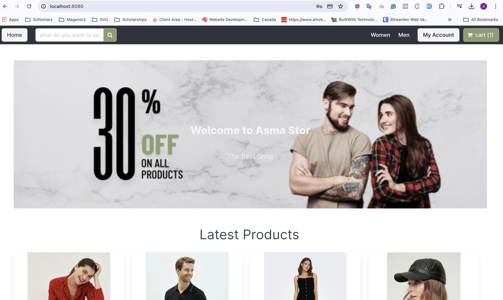

## The Code Challenge

### The Main Task
In this section, you have to build a checkout page. You will find below a description of the requirements. Based on the requirements, and with the help of our documentation, you should determine the integration method to be used as well as which payment methods to provide. You should then code a minimalistic checkout page with all the necessary functionalities and features.

## The Solution

### The FrameWork

#### Django
is a free and open-source, Python-based web framework that runs on a web server. It follows the model–template–views architectural pattern.
#### Vue.js
is a  Progressive JavaScript Framework which will be here the Frontend for the application

Django with Vue.js is very powerful, very easy to use and provides tools required for large, robust applications.

### The Packages 

- Axios for APIs requests
- Bulma for rendering the webpages
- Djnago RestFul APIs

### The Database
- Sqlite3

## How to run the application?
ps:: The application has two servers one for the backend and one for Frontend and we will run them both 
1- Django
- download the repo on your local machine
- cd to the djackets_django 
- run the server " python manage.py runserver"

2- Vue.js
- download the repo on your local machine
- cd to the djackets_vue
- install npm modules
- run the server "npm run serve"

### About the Project
Tech used: 
- Python
- JavaScript
- Sqlite3

#### Home Page 

kindly refer to [this link](https://www.loom.com/share/30d49827d7d745a28e2dad1c05b02b92?sid=3fc41394-da6e-42b9-935f-719b07f0d1da) for frontend Demo:

kindly refer to [this link](https://www.loom.com/share/7de3690c736e4e38874adda5d5d2fa5c?sid=05ee459d-5106-4ac5-8b6f-bf0eba0aa125 for Backend Demo

## suggested improvements
- Integrates with CI/CD processes on GitLab.
- make more tests to catch every exception that might be thrown.
- Enable 3ds for Frames.
 
## License
The Django framework is open-sourced software licensed under the [MIT license](https://opensource.org/licenses/MIT).
